# 失物招领后端

## 数据表

### 用户表

``` sql
create table user
(
    id          int auto_increment
        primary key,
    create_time timestamp default CURRENT_TIMESTAMP not null comment '创建时间',
    update_time timestamp default CURRENT_TIMESTAMP not null comment '更新时间',
    name        varchar(10) charset latin1          null comment '用户名',
    password    varchar(50) charset latin1          null comment '密码',
    avatar      varchar(50) charset latin1          null comment '用户头像',
    phone       varchar(20) charset latin1          null comment '手机号码,一个手机号只能注册一个账号',
    status      tinyint                             null comment '用户的状态，0表示正常使用，-1表示被禁用',
    constraint phone
        unique (phone)
);
```

### 管理员表

```sql
create table administrator
(
    id          int auto_increment comment '管理员编号'
        primary key,
    create_time timestamp default CURRENT_TIMESTAMP not null comment '创建时间',
    update_time timestamp default CURRENT_TIMESTAMP not null comment '更新时间',
    name        varchar(30)                         null comment '管理员名称',
    password    varchar(50)                         null comment '密码',
    phone       varchar(20)                         null comment '手机号码,一个手机号只能注册一个账号',
    level       tinyint                             null comment '管理员的等级',
    status      tinyint                             null comment '管理员的状态，0表示正常使用，-1表示被禁用',
    constraint phone
        unique (phone)
)
```

注意: mysql中的tinyint对应java中的int

### 分类表

``` sql
create table category
(
    category_id    int                                 not null
        primary key,
    category_name  varchar(10)                         null comment '类别的名称',
    category_alias varchar(10)                         null comment '类别的别名',
    create_user    int                                 null comment '创建用户的id',
    create_time    timestamp default CURRENT_TIMESTAMP not null comment '创建时间',
    update_time    timestamp default CURRENT_TIMESTAMP not null comment '更新时间',
    constraint category___fk
        foreign key (create_user) references user (id)
)
    comment '分类表';
```


### 失物表

``` sql
create table lost_item
(
    id            int auto_increment
        primary key,
    create_time   timestamp default CURRENT_TIMESTAMP not null comment '创建时间',
    update_time   timestamp default CURRENT_TIMESTAMP not null comment '更新时间',
    name          varchar(25)                         null comment '失物名称',
    image         varchar(50)                         null comment '失物图片',
    category_id   int                                 null comment '失物类别',
    lost_location varchar(20)                         null comment '丢失地点',
    lost_time     timestamp default CURRENT_TIMESTAMP not null comment '丢失时间',
    description   varchar(100)                        null comment '详细描述',
    owner_name    varchar(20)                         null comment '失主姓名',
    phone         varchar(20)                         null comment '失主手机号码',
    founded       tinyint(1)                          null comment '是否已经找到',
    create_user   int                                 null comment '创建这条失物信息的用户id',
    constraint lost_item___fk
        foreign key (create_user) references user (id)
);


```

### 招领表

``` sql
create table found_item
(
    id             int auto_increment
        primary key,
    create_time    timestamp default CURRENT_TIMESTAMP not null comment '创建时间',
    update_time    timestamp                           null comment '更新时间',
    name           varchar(25)                         null comment '物品名称',
    claimed        tinyint(1)                          null comment '是否已经认领',
    image          varchar(50)                         null comment '物品图片',
    category_id    int                                 null comment '物品类别',
    found_location varchar(20)                         null comment '发现地点',
    found_time     timestamp default CURRENT_TIMESTAMP not null comment '发现时间',
    description    varchar(100)                        null comment '详细描述',
    owner_name     varchar(20)                         null comment '姓名',
    phone          varchar(20)                         null comment '手机号码',
    create_user    int                                 null comment '创建这条招领信息的用户id',
    constraint found_item___fk
        foreign key (create_user) references user (id)
);


```


## 用到的依赖

Lombok

MyBatis

Redis

Jackson

hutool 工具类

## 拦截器

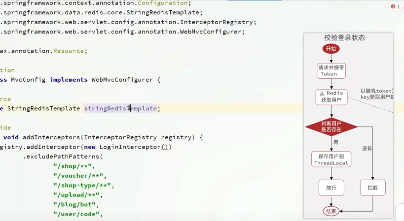

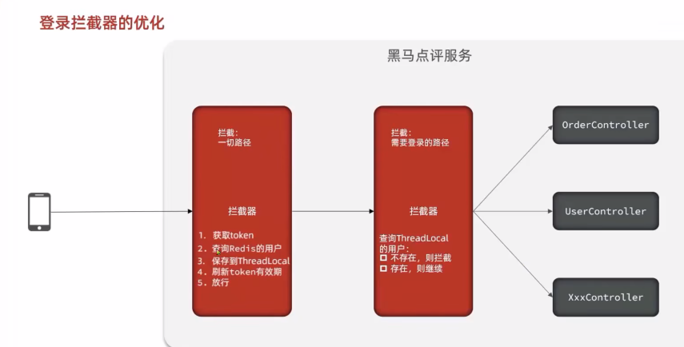


添加拦截器，使得未登录的用户无法进入除了登录和注册之外的页面

管理员无法进入除登录以外的页面

管理员不再设置注册，只能从头部管理员处添加管理员（管理员权限不同）

也就是说只有添加管理员权限的管理员能添加新的管理员（Level=100)


## ThreadLocal

使用ThreadLocal为每个登录的用户/管理员线程分配一个副本，防止访问冲突

## Jasypt

使用jasypt对mysql数据库的用户名和密码进行加密，防止暴露在propertie文件中

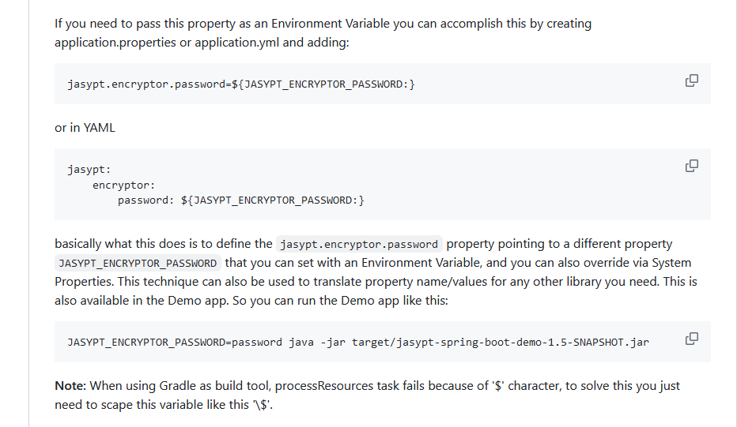

``` 
## 配置properties文件
jasypt.encryptor.password=${JASYPT_ENCRYPTOR_PASSWORD:}

##启动项目时配置环境变量
JASYPT_ENCRYPTOR_PASSWORD=password java -jar target/jasypt-spring-boot-demo-1.5-SNAPSHOT.jar
```


## API

### Admin

路径为/admin

#### /login 登录

登录接口，使用方法如下:

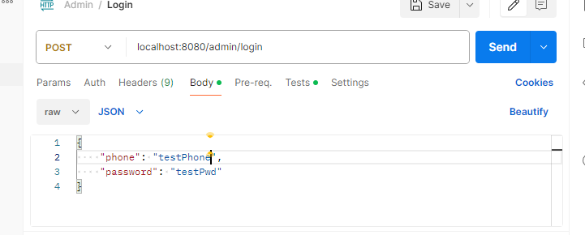

前端传Json数据即可

返回数据:

​	data表示登录后发放的token,之后用户访问页面都需要在请求头携带该token

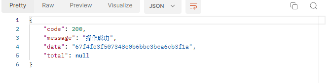

携带请求头如图

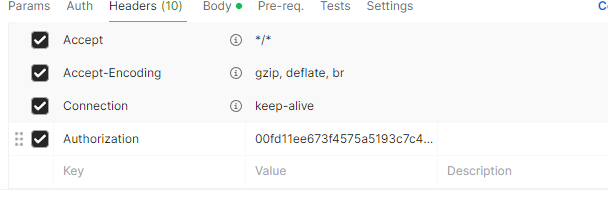


#### /logout 登出

携带请求头，请求体为空

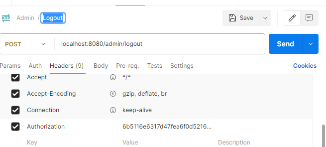


#### /code 发送验证码

携带请求头，请求体为空

发送验证码后验证码将发送到登录用户的手机号

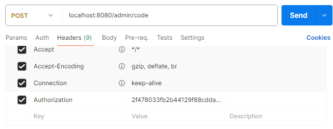

#### /validateSmsCode 验证验证码

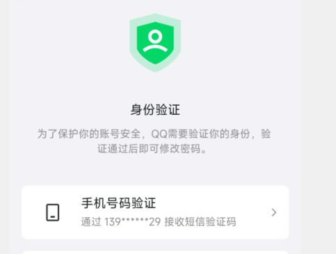


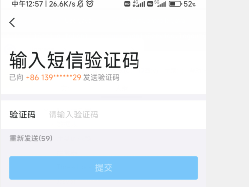


请求参数 code: 用户输入的验证码

与后台存放的验证码比较 

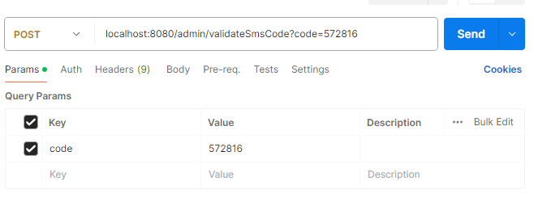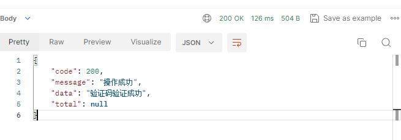

#### /modifyPwd  修改密码

注意这个接口一定要在验证码正确后再使用，需要前端调用校验验证码接口，验证码正确后再跳转到修改密码的页面调用这个接口

这里密码的要求是 必须包含大小写字母和特殊符号，至少8位

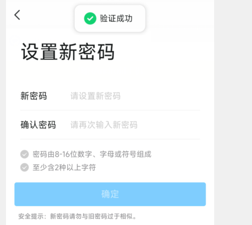


点击下一步要调用validateSmsCode接口来校验验证码，如果验证码正确就进入设置新密码的页面

**前端逻辑**：

- 使用JavaScript/Ajax发送异步请求到后端接口。
- 在用户提交验证码后，检查后端返回的结果。如果验证码正确，再将用户重定向到修改密码的页面或发送一个请求到修改密码的接口。

### User

路径为/user

/login

### LostItem

路径为/lost

### FoundItem

路径为/found

### Category

路径为/category

