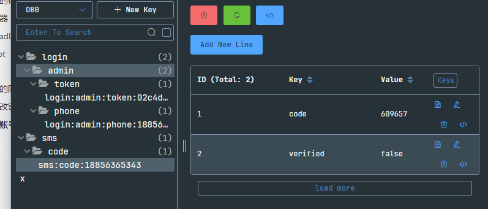
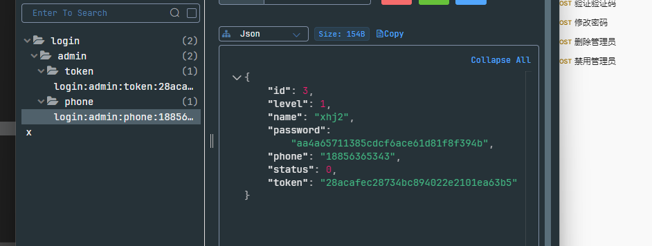

# 失物招领后端

## 数据表

### 用户表

``` sql
create table user
(
    id          int auto_increment
        primary key,
    create_time timestamp default CURRENT_TIMESTAMP not null comment '创建时间',
    update_time timestamp default CURRENT_TIMESTAMP not null comment '更新时间',
    name        varchar(10) charset latin1          null comment '用户名',
    password    varchar(50) charset latin1          null comment '密码',
    avatar      varchar(50) charset latin1          null comment '用户头像',
    phone       varchar(20) charset latin1          null comment '手机号码,一个手机号只能注册一个账号',
    status      tinyint                             null comment '用户的状态，0表示正常使用，-1表示被禁用',
    constraint phone
        unique (phone)
)  charset = utf8mb4;;

```

### 管理员表

```sql
create table administrator
(
    id          int auto_increment comment '管理员编号'
        primary key,
    create_time timestamp default CURRENT_TIMESTAMP not null comment '创建时间',
    update_time timestamp default CURRENT_TIMESTAMP not null comment '更新时间',
    name        varchar(30)                         null comment '管理员名称',
    password    varchar(50)                         null comment '密码',
    phone       varchar(20)                         null comment '手机号码,一个手机号只能注册一个账号',
    level       tinyint                             null comment '管理员的等级',
    status      tinyint                             null comment '管理员的状态，0表示正常使用，-1表示被禁用',
    constraint phone
        unique (phone)
) charset = utf8mb4;
```

注意: mysql中的tinyint对应java中的int

## 管理员通知表

``` sql
create table admin_news
(
    id           int auto_increment comment '管理员通知的id'
        primary key,
    title        varchar(20)   not null comment '通知的标题',
    description  varchar(50)   null comment '文章的描述',
    create_admin int           null comment '创建人的id',
    create_time  timestamp     null comment '创建时间',
    update_time  timestamp     null comment '更新时间',
    content      varchar(2000) null comment '通知具体内容,字数在2000以内',
    constraint admin_news___fk
        foreign key (create_admin) references administrator (id)
) charset = utf8mb4;
```

### 分类表

``` sql
create table category
(
    category_id    int auto_increment
        primary key,
    category_name  varchar(10) charset latin1          null comment '类别的名称',
    category_alias varchar(10) charset latin1          null comment '类别的别名',
    create_user    int                                 null comment '创建用户的id',
    create_time    timestamp default CURRENT_TIMESTAMP not null comment '创建时间',
    update_time    timestamp default CURRENT_TIMESTAMP not null comment '更新时间',
    constraint category___fk
        foreign key (create_user) references user (id)
)
    comment '分类表' charset = utf8mb4;

```


### 失物表

``` sql
create table lost_item
(
    id            int auto_increment
        primary key,
    create_time   timestamp default CURRENT_TIMESTAMP not null comment '创建时间',
    update_time   timestamp default CURRENT_TIMESTAMP not null comment '更新时间',
    name          varchar(25)                         null comment '失物名称',
    image         varchar(50)                         null comment '失物图片',
    category_id   int                                 null comment '失物类别',
    lost_location varchar(20)                         null comment '丢失地点',
    lost_time     timestamp default CURRENT_TIMESTAMP not null comment '丢失时间',
    description   varchar(100)                        null comment '详细描述',
    owner_name    varchar(20)                         null comment '失主姓名',
    phone         varchar(20)                         null comment '失主手机号码',
    founded       tinyint(1)                          null comment '是否已经找到',
    create_user   int                                 null comment '创建这条失物信息的用户id',
    constraint lost_item___fk
        foreign key (create_user) references user (id)
) charset = utf8mb4;


```

### 招领表

``` sql
create table found_item
(
    id             int auto_increment
        primary key,
    create_time    timestamp default CURRENT_TIMESTAMP not null comment '创建时间',
    update_time    timestamp                           null comment '更新时间',
    name           varchar(25)                         null comment '物品名称',
    claimed        tinyint(1)                          null comment '是否已经认领',
    image          varchar(50)                         null comment '物品图片',
    category_id    int                                 null comment '物品类别',
    found_location varchar(20)                         null comment '发现地点',
    found_time     timestamp default CURRENT_TIMESTAMP not null comment '发现时间',
    description    varchar(100)                        null comment '详细描述',
    owner_name     varchar(20)                         null comment '姓名',
    phone          varchar(20)                         null comment '手机号码',
    create_user    int                                 null comment '创建这条招领信息的用户id',
    constraint found_item___fk
        foreign key (create_user) references user (id)
) charset = utf8mb4;


```


## 用到的依赖

Lombok

MyBatis

Redis

Jackson

hutool 工具类

## 拦截器


添加拦截器，使得未登录的用户无法进入除了登录和注册之外的页面

管理员无法进入除登录以外的页面

管理员不再设置注册，只能从头部管理员处添加管理员（管理员权限不同）

也就是说只有添加管理员权限的管理员能添加新的管理员（Level=100)


## ThreadLocal

使用ThreadLocal为每个登录的用户/管理员线程分配一个副本，防止访问冲突

## Jasypt

使用jasypt对mysql数据库的用户名和密码进行加密，防止暴露在propertie文件中


``` 
## 配置properties文件
jasypt.encryptor.password=${JASYPT_ENCRYPTOR_PASSWORD:}

##启动项目时配置环境变量
JASYPT_ENCRYPTOR_PASSWORD=password java -jar target/jasypt-spring-boot-demo-1.5-SNAPSHOT.jar
```


## SpringSecurity


## API

### Admin

路径为/admin

#### /login 登录

登录接口，使用方法如下:


前端传Json数据即可

返回数据:

​	data表示登录后发放的token,之后用户访问页面都需要在请求头携带该token


携带请求头如图


#### /logout 登出

携带请求头，请求体为空


#### /code 发送验证码

携带请求头，请求体为空

发送验证码后验证码将发送到登录用户的手机号


#### /validateSmsCode 验证验证码


请求参数 code: 用户输入的验证码

与后台存放的验证码比较 


#### /modifyPwd  修改密码

注意这个接口一定要在验证码正确后再使用，需要前端调用校验验证码接口，验证码正确后再跳转到修改密码的页面调用这个接口

这里密码的要求是 必须包含大小写字母和特殊符号，至少8位


点击下一步要调用validateSmsCode接口来校验验证码，如果验证码正确就进入设置新密码的页面

**前端逻辑**：

- 使用JavaScript/Ajax发送异步请求到后端接口。
- 在用户提交验证码后，检查后端返回的结果。如果验证码正确，再将用户重定向到修改密码的页面或发送一个请求到修改密码的接口。

### User

路径为/user

/login

### LostItem

路径为/lost

### FoundItem

路径为/found

### Category

路径为/category


## 遇到的阻碍和问题

### 修改密码的问题

管理员需要校验验证码并通过之后才能使用修改密码的接口，否则如果有人绕过前端校验，直接访问修改密码的接口时，会直接修改掉他的密码

可能的解决方法1：用拦截器，当校验密码后，将AdminDTO的allowModifyPwd设置为true，但是我么的

AdminDTO是存放在ThreadLocal中的，从validatePwd接口中设置allowModifyPwd时，可能因为不是同一个线程，导致主线程中的AdminDTO不会改变，其allowModifyPwd仍为false, 拦截器依然会拦截admin访问修改密码的接口

```java
@Data
@AllArgsConstructor
@NoArgsConstructor
public class AdminDTO{
    private Long id;
    private String phone;
    private String name;

    //用于判断admin或者user是否具有修改密码的权限
    private Boolean allowModifyPwd = false;
    private Integer level;
    @Override
    public String toString(){
        return "管理员"+id+"\n姓名:"+name+"\n电话:"+phone+"\n等级:"+level+"\n是否允许修改密码:"+allowModifyPwd;
    }
}

```

解决方法2:

当校验验证码成功后，在redis里存放一个verificationStatus字段，修改验证码之后再删除，这个方法简单并且比第一个方法好

``` java
    @Override
    protected boolean getAllowModifyPwd(AdminDTO admin) {
        String result = RedisUtils.get(ADMIN_VERIFICATION_STATUS+admin.getPhone());
        if(result == null){
            //redis中不存在 result,也就是已经修改过,不允许未经验证重复修改
            return false;
        }
        //当result为true时也就是验证通过，允许修改密码
        return Boolean.parseBoolean(result);
    }
```

解决方法3：

在Redis的验证码中添加一个verificationStatus字段，直接从该字段判断是否验证成功了



``` java
@Slf4j
public class AdminPwdInterceptor extends PwdInterceptor<AdminDTO> {
    @Override
    protected boolean getAllowModifyPwd(AdminDTO admin) {
        Map<Object,Object>result = RedisUtils.hmget(SMS_CODE_KEY+admin.getPhone());
        //redis中不存在 result,也就是已经修改过,不允许未经验证重复修改
        //当result为true时也就是验证通过，允许修改密码
        String verified = (String) result.get("verified");
        return Boolean.parseBoolean(verified);
    }
}
```


至此，这个问题解决！！


## 一个账号多人登录的问题



在Redis存储的admin信息中保存一个token的值

登录前先查询是否有token，如果有，就删除上一次登录的token，并更新登录后的admin信息

